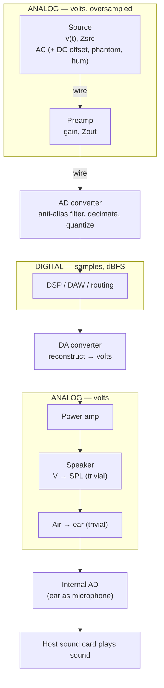

# Audio Engineer Simulator — Project Plan

## 1. Vision

A gamified "digital twin" of the audio-engineering medium. You build, wire, and operate
realistic signal chains — from instruments through analog gear, across the AD/DA boundary,
into the digital domain — and the simulator faithfully models the *signal between devices*.

Crucially, in the analog domain the signal **is a real voltage in a wire** — a time-varying
`v(t)` in actual volts — not a digital buffer with metadata. Levels, impedance loss, clipping,
noise, DC offset, phantom power, and hum are not flags; they **emerge from the voltage
physics**. Digital samples exist only *after* a modeled AD converter samples that voltage, and
sound is produced by converting back to volts (DA), through a deliberately trivial
speaker/air/ear abstraction, and a final internal AD that hands audio to the host.

Devices are modeled after real-world gear with an emphasis on **functionality and realistic
layout** (a mixer looks and behaves like a mixer, with the right knobs roughly where they
belong, and real-world I/O). Internally each device is a **black box**: it transforms the
signal according to its codified behavior, and the engine simulates the conditions at its
input and output.

The purpose is learning. This is a tool to build deep, hands-on intuition about complex
audio-engineering topics that are impractical to try in real life — advanced routing,
studio wiring, large-scale live sound — plus the analog medium (voltages, impedance, AD/DA)
and DSP.

## 2. Goals & Non-Goals

### Goals
- A **correct-enough simulation engine** that models the signal as it really behaves between
  devices: levels (dBu/dBV/dBFS), impedance, noise, headroom/clipping, cable losses, and the
  analog↔digital boundary.
- **Real audio**: the engine processes real sample buffers and can ultimately be heard.
- **Realistic, recognizable devices** modeled from real gear — functional behavior and layout
  distilled from device manuals, keeping the most important controls and I/O.
- **Breadth across the medium**: studio signal chains, routing/patching, and live sound — all
  built on one shared engine.
- A **sandbox plus structured challenges** so learning can be both free-form and guided.

### Non-Goals
- Not modeling internal circuitry / component-level electronics. The boundary of interest is
  *between* devices and at their I/O, not inside them.
- Not aiming for instrument realism — instruments are simple, recognizable synth voices.
- Not a commercial product (initially). Polish, onboarding, and shareability are explicitly
  deprioritized in favor of fidelity and breadth.
- Not a DAW. Recording/arranging is out of scope except where it serves the learning goal.

## 3. Guiding Principles

1. **Clarity, but honest and correct-enough.** Favor models that are understandable and
   directionally correct. Simplify messy reality, but never teach something false. The engine
   must be faithful enough to model noise, long cable runs, impedance interactions, gain
   staging, and clipping in a way that matches real-world intuition. Surface simplifications
   where they matter ("real desks also do X").
2. **The analog signal is a voltage, not a sample buffer.** In the analog domain the medium is
   a real, oversampled voltage waveform in volts, and devices present real electrical terminals
   (output impedance, input impedance, cable impedance). Physical behavior — levels, impedance
   loss, clipping, noise, DC, hum — emerges from the voltage math rather than being annotated
   onto a normalized buffer. Digital samples appear only after a modeled AD converter. No
   throwaway parameter-only model that has to be migrated later.
3. **Devices are black boxes.** Each device exposes realistic controls and I/O and a codified
   transform. We model observable behavior, not circuitry.
4. **Engine before UI.** The engine is the novel, risky core and is built and validated first,
   headless. The UI is a pure consumer of a clean engine API, built once against the final
   model.
5. **Audio is the ground-truth oracle for DSP; tests are the oracle for the analog domain.**
   Wrong dynamics/DSP can be heard; cable loss, impedance ratios, and noise floors cannot be
   heard reliably and are validated numerically.

## 4. Core Concepts (Domain Model)

These are conceptual; technical implementation is derived separately.

- **Signal** — the thing that flows, and it differs by domain:
  - *Analog:* a real, oversampled **voltage waveform** `v(t)` in volts. For balanced lines this
    is two conductors (V+, V−). DC components (offset, phantom) ride on the same waveform.
  - *Digital:* a sample stream in dBFS at a given sample rate and bit depth, produced only by a
    modeled AD converter.
  - A light classification tag (mic / line / instrument / speaker / digital format such as
    AES/ADAT/USB) may ride along for UX and validation, but the *behavior* comes from the
    physics, not the tag.
- **Device** — a black box that presents **real electrical terminals**: each output is a
  Thévenin equivalent (ideal voltage source + series **output impedance**), each input has an
  **input impedance**. It has **controls** (knobs/switches/faders), internal **state**, and a
  **transform** mapping input signal(s) → output signal(s). Modeled from real gear: realistic
  layout, the important controls, realistic I/O.
- **Port** — a typed connection point (mic in, line out, insert, digital I/O, etc.) carrying
  its impedance and (for analog) its voltage. Type and impedance expectations are not validated
  by rules but realized by the voltage physics — mismatches simply produce the real measurable
  consequence.
- **Connection (cable)** — links an output port to an input port and is itself an electrical
  element: series resistance + capacitance (HF rolloff on long runs), noise pickup, and
  balanced/unbalanced behavior. The voltage a receiver sees is the voltage-divider result of
  source impedance, cable impedance, and load impedance.
- **Instrument / source** — a simple synth voice or test source (tone, noise, sample) that
  injects a signal into the graph. Recognizable, not realistic.
- **Sink** — where signal terminates: a meter/scope, a file render, or (later) the audio
  output.
- **Graph / patch** — the full set of devices and connections; the "studio" the user builds.

## 5. The Simulation Engine

The heart of the project. A directed graph of devices connected by cables. In the analog
domain the engine propagates **real voltage** through the graph; at AD converters it crosses
into the **digital** domain (samples in dBFS); at DA converters it crosses back to volts. Each
device and cable applies its transform; physical behavior emerges from the voltages.

### 5.1 The signal journey across domains



Two distinct AD/DA layers, both intentional:
- The **modeled** AD/DA (your audio interface) — pedagogically rich; the thing you're learning.
- The **final internal AD** — pure plumbing; the "ear as a microphone" that captures the
  simulated acoustic output so the host sound card can play it.

### 5.2 Oversampled analog domain (the key decision)

The analog domain runs at a **high internal sample rate** (e.g. ~8× the digital rate) as a
proxy for "continuous." This is what makes the AD/DA boundary real and teachable:
- The modeled **AD** does a genuine job — anti-alias filter → decimate → quantize. Weaken the
  filter and aliasing actually folds back; drop bit depth and quantization noise is audible.
- The modeled **DA** does upsample → reconstruction filter back to volts.

Honest caveat (per the clarity-but-honest principle): it is still discrete samples under the
hood — true continuity is impossible on a computer. Heavy oversampling is exactly how real
converters and analog-modeling plugins approximate continuous, so this is faithful, not a
cheat, and the plan states it as such.

### 5.3 Electrical model — port/network level, not circuitry

We model **between** devices, not inside them. Each output is a Thévenin source (voltage +
series output impedance `Zout`); each input has input impedance `Zin`; each cable adds series
resistance and capacitance. The voltage a receiver sees is a voltage divider:

```
   V_in = V_src · Zin / (Zout + Zcable + Zin)
```

From this single relationship the important cases emerge:
- **Bridging** (modern pro audio): `Zin ≫ Zout` → `V_in ≈ V_src`, negligible loss.
- **Matching** (vintage 600Ω): `Zin = Zout` → −6 dB.
- **Instrument into a long cable**: high-Z pickup + cable capacitance forms a real low-pass with
  an audible corner (the "buffer your pedalboard" lesson), emergent.

Because pro devices **buffer** their I/O (low Zout, high Zin; the output does not load back
through the input), connections are solved **locally** — no global nodal/SPICE solve. Fan-out
(splitters/mults) is parallel input impedances. Genuine electrical feedback loops live inside
devices, which we don't model, so they don't arise.

### 5.4 What emerges for free (and is therefore a first-class learning target)

These are not special-cased — they fall out of modeling real volts:
- **AC vs DC**: audio is the AC swing; **DC offset** is real and removed by a DC-blocking
  high-pass.
- **Phantom power (+48 V)**: a common-mode DC riding the line; condenser mics draw it.
- **Balanced vs unbalanced**: two conductors (V+, V−); the receiver takes the difference, so
  interference coupling equally to both cancels — **common-mode rejection / hum immunity emerge**.
- **Ground-loop hum**: a 50/60 Hz common-mode injection (50 EU / 60 US); balanced lines reject
  it, unbalanced don't — the classic "lift the ground" lesson.
- **Headroom & clipping**: the signal hits the rail voltage and clips — physical, in volts.
- **Noise**: device noise floors and cable pickup in microvolts; SNR degrades down the chain.
- **Real level standards**: 0 dBu = 0.775 V, +4 dBu ≈ 1.23 V, −10 dBV ≈ 0.32 V; the **AD's
  reference voltage** maps volts → dBFS (e.g. "+4 dBu = −18 dBFS" calibration), making gain
  staging across the analog/digital boundary concrete.

### 5.5 Where we stay deliberately simple

Guard against scope creep into acoustics — this is not an acoustic project:
- **Speaker**: V → SPL via one sensitivity figure + a simple frequency-response curve. No cone
  physics, no cabinet modeling.
- **Air → ear**: trivial — a fixed attenuation, or nothing. No room acoustics, no propagation.
- **Internal AD**: plumbing only.

DSP transforms (filters, dynamics, etc.) start simple and deepen in later stages. The realism
budget is spent specifically on the volts-and-converters layer; device transforms above the
wire stay understandable.

## 6. Devices & Instruments

- **Device modeling source of truth:** real device manuals. We distill the most important
  controls and I/O and the documented behavior, then codify a black-box transform that is
  correct-enough and clear.
- **Layout:** realistic — controls roughly where they are on the real unit, real I/O on the
  back. Recognizable at a glance.
- **Instruments:** a small synth-like system producing recognizable voices and test signals.
  Deliberately simple; reality is not the goal here.

## 7. Interaction & UX

- **Primary paradigm (first):** skeuomorphic device panels with **patch cables** — devices look
  like the gear, you drag cables between physical-looking I/O. This matches the "a mixer is a
  mixer" goal and the immersive, hands-on learning intent.
- **Later:** an optional **schematic / node-graph view** over the same model for routing
  overview and large setups ("realistic front, schematic back").
- Visualization (meters, scopes, spectrum, readouts) is a **product** concern built in the UI
  stage. Before that, observation is **developer tooling** (tests, plots, WAV dumps).

## 8. Learning & Gamification

- **Sandbox:** an open studio to build and experiment freely. Self-directed learning.
- **Structured challenges:** scenario missions layered on top — e.g. "get this signal to the
  desk without clipping", "fix the hum", "split FOH and monitors", "match levels across the
  AD/DA boundary". Diagnostic/troubleshooting puzzles fit naturally here.
- Challenges are a later-stage concern; the sandbox + engine come first.

## 9. Staged Roadmap

The spine: **engine → offline audio → real-time audio → UI → breadth**. Each stage produces
something usable and validates the riskiest remaining unknown.

### Stage 1 — Headless voltage engine
Build the core engine and voltage-native signal model with no product UI.
- Graph of devices + cables propagating **oversampled voltage** in the analog domain, with
  Thévenin-source outputs, input impedances, and electrical cable models.
- A minimal device set that proves the model end-to-end: a synth/source (with real Zout), a
  couple of simple analog devices (e.g. a gain/preamp stage, a cable, a simple sum/mixer), a
  modeled **AD** and **DA** crossing into and back out of the digital domain, and a sink.
- Realize levels, impedance interaction, noise, and cable loss from the voltage math; the AD/DA
  pair makes the analog↔digital boundary (reference voltage → dBFS, quantization) real.
- **Observation = developer tooling:** unit tests with numeric assertions for the analog domain
  (volts, divider losses, impedance cases, noise, dBu↔dBFS calibration), plus the ability to
  define a graph in code/config and run it.
- **Exit criteria:** a defined patch runs end-to-end through analog→AD→digital→DA→analog;
  voltage and conversion behavior is asserted by tests and matches hand calculations.

### Stage 2 — Offline render to audio ("hear it" cheaply)
Reach the audio goal without real-time infrastructure.
- Render N seconds of a graph's output to a WAV file (through the full chain to the internal AD).
- Introduce the first real DSP transforms (e.g. a filter and a simple dynamics processor) and a
  trivial speaker/air/ear stage so there's something meaningful to hear.
- Demonstrate the converter payoff by ear: aliasing with a weak anti-alias filter, quantization
  noise at low bit depth.
- **Oracle = ears (DSP/dynamics, converter artifacts) + tests (analog domain).**
- **Exit criteria:** you can build a chain, render it, and the result sounds correct;
  DSP and converter behavior is validated by listening and by golden-file tests.

### Stage 3 — Real-time playback
Make it live.
- Real-time audio output (Web Audio / AudioWorklet or equivalent): block processing, no
  allocation in the audio callback, latency management.
- Live, audible response to a running graph.
- **Exit criteria:** a running patch is audible in real time and stable (no dropouts/glitches
  under normal use).

### Stage 4 — UI: skeuomorphic panels + patch cables
Build the product interface on top of the proven engine.
- Realistic device panels with working controls bound to the engine.
- Drag-to-patch cables between realistic I/O.
- Product visualization: meters, scope, spectrum, and analog-domain readouts.
- **Exit criteria:** you can build and operate a small studio entirely through the UI and
  hear/see the results.

### Stage 5 — Breadth & challenges
Grow coverage and add the game layer.
- More devices (deeper mixer, more processors, converters, patchbays).
- More of the medium: advanced routing/patching, studio wiring scenarios, live-sound setups
  scaling toward large venues.
- Deeper DSP and deeper AD/DA modeling as needed.
- Structured challenges / diagnostic scenarios on top of the sandbox.
- Optional schematic / node-graph view.

## 10. Risks & Open Questions

- **Oversampling factor & compute cost.** The voltage domain runs oversampled (e.g. ~8×), which
  multiplies compute. Fine for offline render; needs attention at the real-time stage. The exact
  factor is a tradeoff between converter realism (aliasing headroom) and cost — to be tuned.
- **Real-time audio fidelity** is the heaviest technical unknown; deliberately deferred behind
  offline render so the engine is proven first. The oversampled voltage domain makes the
  real-time budget tighter — revisit the oversampling factor there.
- **Offline-WAV vs real-time split** (Stages 2 vs 3) is a chosen simplification to reach the
  audio oracle cheaply — revisit if real-time turns out to be needed earlier.
- **How deep does the voltage model go?** Start correct-enough: Thévenin ports + resistive
  dividers + cable R·C + common-mode (phantom/hum) modeling. Decide per-feature whether deeper
  fidelity (frequency-dependent impedances, reactive loads, transformer behavior) earns its
  complexity. The realism budget is for the volts-and-converters layer; keep device transforms
  and the speaker/air/ear stage simple.
- **Device behavior fidelity from manuals** — manuals describe controls, not always exact
  transfer behavior; some transforms will be informed approximations. Flag these.
- **DSP depth vs breadth** — how much real DSP to build vs. how many devices to cover. Lean on
  the learning goal to prioritize.
- **Platform/tech stack** — to be derived from this plan (leans toward web given existing
  expertise, but not yet decided).

## 11. Success Criteria

- You can build a realistic signal chain and the simulator's behavior matches your real-world
  intuition and hand calculations for voltages, levels (dBu/dBV↔dBFS), impedance, noise, and
  cable loss — with phenomena like clipping, hum, and phantom power emerging from the physics.
- You can hear the chain, DSP/dynamics sound correct, and converter artifacts (aliasing,
  quantization) are demonstrable.
- The same engine credibly supports studio, routing, and live-sound scenarios.
- Working in the simulator measurably deepens your understanding of routing, the analog
  medium, AD/DA, and DSP — the original purpose.
